# 🚀 Fly.io 自动部署设置指南

## 当前状态
✅ **项目已成功部署到 fly.io**  
✅ **Mission Pitch Agent 已包含在最新部署中**  
✅ **准备设置 Fly.io 原生自动部署**  

**部署 URL**: https://chat-agent-y6oijw.fly.dev

## 🔧 设置 Fly.io 原生自动部署

### 方法 1：通过 Fly.io Dashboard（推荐）

1. **访问应用设置页面**
   ```
   https://fly.io/apps/chat-agent-y6oijw/settings
   ```

2. **找到 "Build & Deploy" 或 "GitHub Integration" 部分**

3. **连接 GitHub 仓库**
   - 点击 "Connect GitHub"
   - 授权 Fly.io 访问你的 GitHub 账号
   - 选择 `CatMizu/chat-agent` 仓库
   - 选择 `main` 分支作为部署分支

4. **配置部署触发器**
   - ✅ 推送到 main 分支时自动部署
   - ✅ PR 合并到 main 时自动部署

### 方法 2：使用 Fly Launch

```bash
# 在项目根目录运行
flyctl launch

# 选择以下选项：
# - Would you like to set up automatic deployments from GitHub? Yes
# - Select your GitHub repository: CatMizu/chat-agent
# - Deploy branch: main
```

## 📋 自动部署工作流程

```mermaid
graph LR
    A[推送到 main] --> B[Fly.io 检测到更改]
    B --> C[自动构建 Docker 镜像]
    C --> D[部署到生产环境]
    D --> E[健康检查]
    E --> F[部署完成]
```



## 📋 部署工作流程

```mermaid
graph LR
    A[推送到 main] --> B[GitHub Actions 触发]
    B --> C[部署到 Fly.io]
    C --> D[健康检查]
    D --> E[Mission Pitch Agent 测试]
    E --> F[部署完成]
```



## 🔧 使用方式

### 推送代码自动部署
```bash
git add .
git commit -m "Add new features"
git push origin main
# 🚀 自动部署到 fly.io！
```

### 手动部署（可选）
```bash
flyctl deploy --remote-only
```

## 🌐 API 端点

**Base URL**: https://chat-agent-y6oijw.fly.dev

### Mission Pitch Agent
```bash
# 同步调用
POST /mission-pitch-agent/invoke

# 流式调用  
POST /mission-pitch-agent/stream

# 示例请求
curl -X POST "https://chat-agent-y6oijw.fly.dev/mission-pitch-agent/invoke" \
  -H "Content-Type: application/json" \
  -d '{
    "message": "Hi, I want to develop my Mission Pitch story",
    "model": "gpt-4o-mini",
    "thread_id": "user-123-mission-pitch",
    "user_id": "user-123"
  }'
```

### 其他可用 Agents
- `chatbot`
- `research-assistant` 
- `rag-assistant`
- `command-agent`
- `bg-task-agent`
- `langgraph-supervisor-agent`
- `interrupt-agent`
- `knowledge-base-agent`
- `mission-pitch-agent` ✨

## ✅ 当前功能确认

- ✅ Mission Pitch Agent 已部署
- ✅ 6步工作流程完整实现
- ✅ 会话记忆和状态持久化
- ✅ 品牌原型识别系统
- ✅ 抗阻模式处理
- ✅ 自动部署配置完成

## 🎯 下一步

1. 在 GitHub 中设置 `FLY_API_TOKEN` Secret
2. 推送这些更改到 main 分支
3. 观察自动部署是否成功
4. 测试生产环境中的 Mission Pitch Agent

**设置完成后，每次推送代码到 main 分支都会自动部署到 fly.io！** 🚀